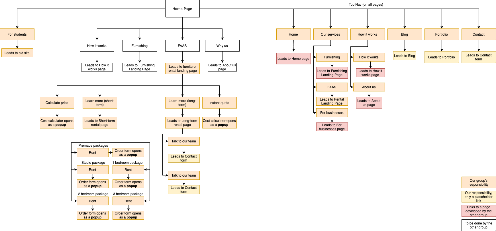

# Homebox
A web dev project for software engineering project course.

Milestones are used to divide issues between sprints in a scrum-but manner. 

Wiki pages for documentation and this ReadMe file for direct project-related information.


## Setup instructions 

Instructions for launching Next.js and NestJS within /frontend and /backend.  

## Tests

# Testing Guide

This project uses [Jest](https://jestjs.io/) and [React Testing Library](https://testing-library.com/docs/react-testing-library/intro/) for unit testing.

# Running Tests

To run the tests, use the following command:

```bash
npm test
```

# Writing Tests

Tests are located in test-folder. All tests have component names with .test.js extension.

Basic structure of unit test file: 

```bash
import React from 'react';
import { render, screen } from '@testing-library/react';
import '@testing-library/jest-dom';
import Component from './Component'; // replace with path to component

describe('Component', () => {
  test('renders Component component without crashing', () => {
    render(<Component />);
    // Add your assertions here
  });

  // Add more tests as needed
});
```

| Requirement | Test file |  
| ------ | ------ |  
| Functional cost calculator |  |  
| Short-term form |  |  
| Long-term form |  |  
| Rental services landing page |  |  
| FAQ page |  |  

## Data objects

TODO  
[A short description of JSON sent by cost calculator]

## Navigation diagram



## Wireframe illustrations

Initial design  
[The first wireframes](navgraphs/Wireframes.pdf)   
Cost calculator multi-step design:    
[Wireframes for cost calculator](https://www.figma.com/file/8lIQboSjwVDg92p4fYcRmp/Untitled?type=design&node-id=0%3A1&mode=design&t=L9L6uzjHahvbiYqo-1)

## People


| Role | Name |  
| ------ | ------ |  
| Project manager  | Iivari Karrila  |  
| Test manager  | Kaisa Kauhanen |  
|Developer | Lotte Karlsson |
|Developer | Inka Ratia |
|Developer | Johanna Meskanen |
|Developer | Saana Hänninen |
|UI/UX designer | Kuura Ahola |


